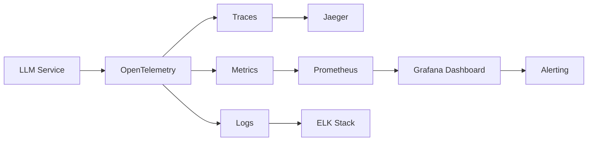

# 🔭 LLM Production Observability

> Full observability stack for production LLM deployments: tracing, token-level metrics, cost tracking, quality monitoring, and alerting.

## 🎯 Overview

Production LLMs need observability beyond standard web services. This framework adds LLM-specific instrumentation: token costs, generation quality scores, hallucination detection, latency breakdowns (TTFT vs decode), and semantic drift monitoring.

## 🧮 Mathematical Foundation

### Cost Tracking
$$\text{Cost}(r) = n_{\text{input}} \times p_{\text{in}} + n_{\text{output}} \times p_{\text{out}}$$

### Latency Decomposition
$$T_{\text{total}} = T_{\text{queue}} + T_{\text{prefill}} + n_{\text{output}} \times T_{\text{decode/token}}$$

### Quality Score (Online)
$$Q_{\text{online}}(y) = w_1 \cdot \text{coherence}(y) + w_2 \cdot \text{relevance}(y, x) + w_3 \cdot (1 - \text{toxicity}(y))$$

### Semantic Drift (Embedding Distance)
$$d_t = \frac{1}{|B_t|}\sum_{y \in B_t} \|\mathbf{e}_y - \boldsymbol{\mu}_{\text{ref}}\|_2$$

Alert when $d_t > \mu_d + 3\sigma_d$ (3-sigma rule).

### Token Efficiency
$$\eta = \frac{\text{useful\_tokens}(y)}{\text{total\_tokens}(y)}$$

Tracks verbosity trends over time — increasing $\eta$ after DPO alignment validates the training investment.

### SLA Compliance
$$\text{SLA} = P(T_{\text{total}} \leq T_{\text{target}}) \geq 0.99$$

## 📊 Dashboard Metrics

| Metric | Granularity | Alert Threshold |
|---|---|---|
| TTFT (p50, p99) | Per request | p99 > 500ms |
| Decode throughput | Per second | < 20 tok/s |
| Cost per query | Rolling 1hr | > $0.05/query |
| Quality score | Per response | < 0.6 |
| Semantic drift | Hourly batch | 3σ deviation |
| Error rate | Per minute | > 1% |
| Token efficiency | Daily | < 0.5 |

### Production Dashboard Components
1. **Real-time:** Request rate, latency heatmap, error rate
2. **Quality:** Online quality scores, hallucination rate, user feedback
3. **Cost:** Token usage, cost breakdown by model/endpoint
4. **Drift:** Embedding drift, topic distribution shift

## License
MIT
